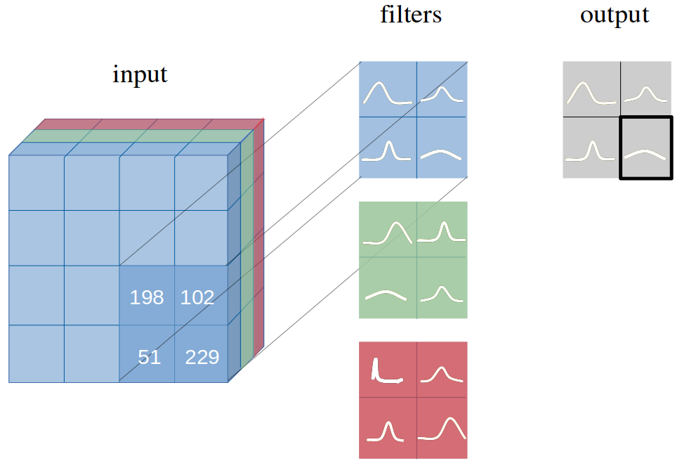
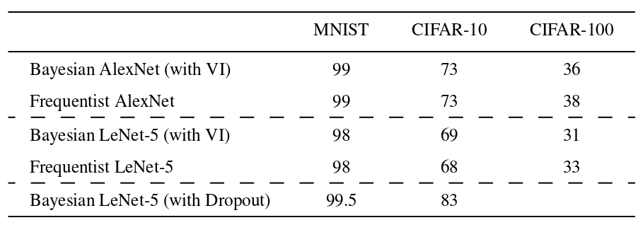
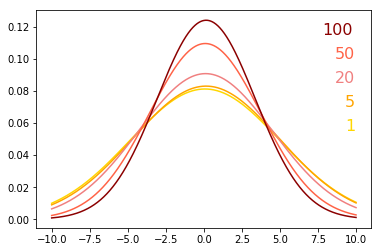

# Bayesian CNN with Variational Inference

We introduce **Bayesian convolutional neural networks with variational inference**, a variant of convolutional neural networks (CNNs), in which the intractable posterior probability distributions over weights are inferred by **Bayes by Backprop**. We demonstrate how our proposed variational inference method achieves performances equivalent to frequentist inference in identical architectures on several datasets (MNIST, CIFAR10, CIFAR100), while the two desiderata, a measure for uncertainty and regularization are incorporated naturally. We examine in detail how this measure for uncertainty, namely the predictive variance, can be decomposed into aleatoric and epistemic uncertainties. 


### One convolutional layer with distributions over weights in each filter



### Fully Bayesian perspective of an entire CNN 


### Results 
Results on MNIST and CIFAR-10 datasets with AlexNet and LeNet architectures:



Change of variational posterior probability distribution of random weight from epoch 1 to 100:



If you use this work, please cite:
```
@article{shridhar2018bayesian,
  title={Bayesian Convolutional Neural Networks with Variational Inference},
  author={Shridhar, Kumar and Laumann, Felix and Llopart Maurin, Adrian and Olsen, Martin and Liwicki, Marcus},
  journal={arXiv preprint arXiv:1806.05978},
  year={2018}
}
```
